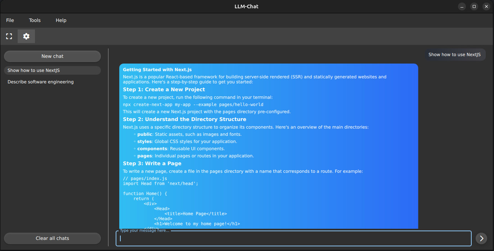

# LLM Chat

A modern desktop chat application built with Qt 6 for interacting with Large Language Models through Ollama.



## Features

- 🎨 Modern Material Design UI
- 💬 Chat interface with message history
- 🔄 Real-time streaming responses
- 🌙 Dark mode
- ⚡ High-performance C++ backend
- ⚙️ Customizable settings
- 🔍 Full-text search capabilities
- 🖥️ Cross-platform support (Windows, Linux)

## Prerequisites

- Qt 6.8.0 or higher
- CMake 3.27 or higher
- C++17 compatible compiler
- Ollama server running locally

## Build Instructions

1. Clone the repository:

```bash
git clone https://github.com/FaZeRs/llm-chat.git
```

2. Build the project:

```bash
cmake -E make_directory build && cd build
cmake ..
make
```

3. Run the tests:

```bash
ctest --output-on-failure
```

4. Install the application:

```bash
cmake --install .
```

## Development Setup

The project includes a complete development environment using Dev Containers. To use it:

1. Install Docker and VS Code with the Dev Containers extension
2. Open the project in VS Code
3. Click "Reopen in Container" when prompted

The container includes all necessary development tools:
- GCC 14 / Clang 18
- CMake
- Qt 6.8.0
- Code analysis tools (clang-tidy, cppcheck)
- Formatting tools (clang-format, cmake-format)

## Project Structure

- `src/` - Source code
  - `core/` - Core application functionality
  - `chat/` - Chat backend and models
  - `quick/` - Qt Quick UI components
  - `qml/` - QML UI files
- `tests/` - Unit tests
- `cmake/` - CMake modules and configuration
- `.github/` - CI/CD workflows

## Contributing

1. Fork the repository
2. Create a feature branch
3. Commit your changes
4. Push to the branch
5. Create a Pull Request

## License

This project is licensed under the MIT License - see the LICENSE file for details.

## Acknowledgments

- Qt Framework
- Ollama
- Catch2 Testing Framework
- CPM.cmake
- Material Design
- Font Awesome Icons

## Contact

Nauris Linde - [@FaZeRs](https://github.com/FaZeRs)

Project Link: https://github.com/FaZeRs/llm-chat
